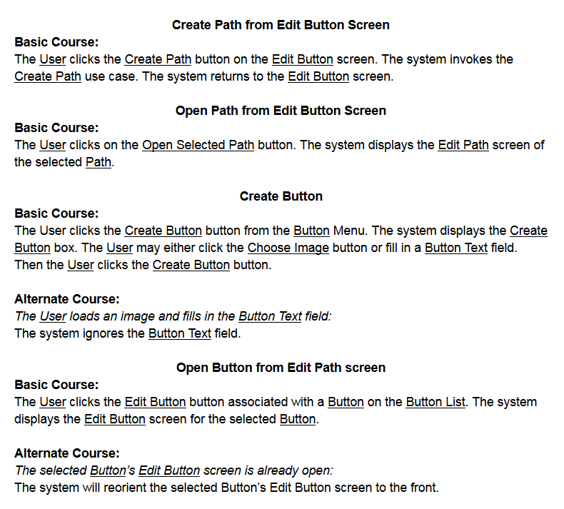

# Project Documentation
Here you will find the documentation we created as we designed Fireside Toolkit. You may notice some 
features that were streamlined into others and others that were added as we discovered the need for
them while learning SFML. Learning is fun!

## Functional Requirements

## Project Glossary

## Domain Model

## Use Case Diagrams
### Use Case Texts
  
  
  
  
  
  
  

### Use Case Models

## Robustness Diagrams
(Images of Robustness Diagrams)

## Sequence Diagrams
(Images of Sequence Diagrams)

## Static Class Diagrams
(Images of Static Class Diagrams)

## Project Scheduling Documents
(Image of Project Schedule) 
(Image of Burndown Chart)
